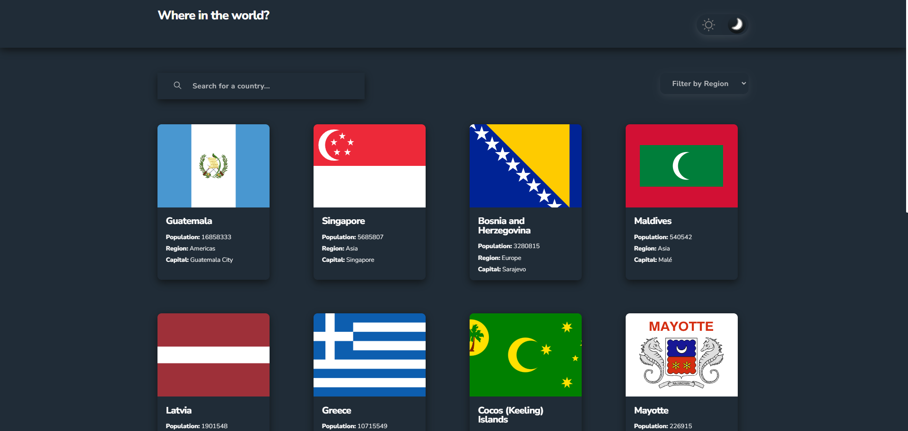

# REST Countries API with color theme switcher solution

## Table of contents

- [Overview](#overview)
  - [The challenge](#the-challenge)
  - [Screenshot](#screenshot)
  - [Links](#links)
- [My process](#my-process)
  - [Built with](#built-with)
  - [Useful resources](#useful-resources)
- [Author](#author)

## Overview

### The challenge

Users should be able to:

- See all countries from the API on the homepage
- Search for a country using an `input` field
- Filter countries by region
- Click on a country to see more detailed information on a separate page
- Click through to the border countries on the detail page
- Toggle the color scheme between light and dark mode

### Screenshot

### Links

- Solution URL: [Github](https://github.com/jhonacs2/countries-api)
- Live Site URL: [Live Site](https://countries-glhirza6e-jhonacs2.vercel.app/countries/all)

## My process

### Built with

- [Angular](https://angular.io/) - Angular 15
- [Sass](https://sass-lang.com/) - For styles
- [Countries Api](https://restcountries.com/) - Api Countries
- [Animate.css](https://animate.style/) - Animations
- [Ngx infinite Scroll](ngx-infinite-scroll) - InfinityScroll
- Semantic HTML5 markup
- CSS custom properties
- Flexbox
- CSS Grid
- 100% Responsive

### Useful resources

- [Dark Mode Angular](https://github.dev/PahanPerera/angular-light-dark-app) -  This helped me add dark theme. adapting it my way and my solution

## Author

- Twitter - [Jhona_CSS](https://twitter.com/Jhona_CSS)
